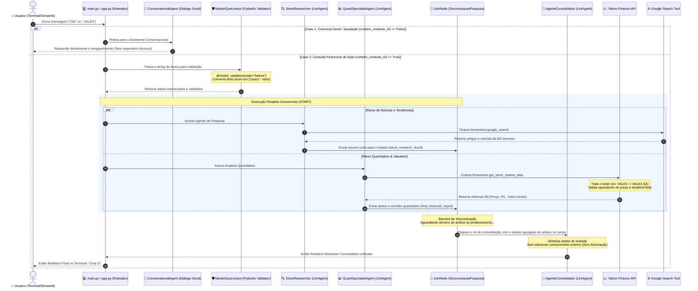

# Arquitetura de Sistemas & Fluxo do Pipeline Multi-Agente

Este documento descreve detalhadamente o design técnico e o fluxo operacional do pipeline de análise financeira automatizada do projeto `agent-with-google-adk`, desenvolvido com o framework moderno do **Google ADK** (Agent Development Kit).

---

## 🗺️ Visão Detalhada do Workflow (Fluxo do Agente)

O diagrama abaixo ilustra o ciclo de vida completo de uma consulta (Query), desde o acionamento pelo usuário no terminal ou navegador, passando pelo roteamento de intenções, a execução concorrente dos sub-agentes especialistas, o bloqueio síncrono no nó de barreira (`JoinNode`), a consolidação contextual e, finalmente, a renderização do relatório final.

---

## 🔍 Detalhamento das Etapas do Pipeline

### 1. Roteamento de Intenções Dinâmico (Intent Router)
O pipeline realiza uma análise léxica na entrada usando a função `contem_contexto_b3`. 
* Se a query for identificada como assunto geral ou saudação, ela é roteada diretamente para o `ConversationalAgent` que responde amigavelmente sem disparar agentes paralelos técnicos.
* Se a query possuir contexto de ativos ou tickers (ex: `VALE3`, `PETR4`), o pipeline completo baseado em grafos é acionado.

### 2. Validação Pydantic Defensiva
* O `MarketQueryInput` converte textos brutos ou objetos de conteúdo da API em esquemas estruturados por meio de um `@model_validator` com execução prévia (`mode="before"`).
* O `FinalAnalysisOutput` define campos opcionais com `default=None`. Isso impede que o sistema quebre caso o LLM decida omitir valores nulos na resposta (ex: P/L inexistente de empresas com prejuízo).

### 3. Paralelismo Concorrente e Sincronização
Os agentes de pesquisa e análise quantitativa rodam em paralelo. A sincronização segura do estado é operada pelo `SincronizacaoPesquisa` (`JoinNode`), que aguarda a conclusão de ambos os ramos concorrentes antes de disparar o consolidador final.
